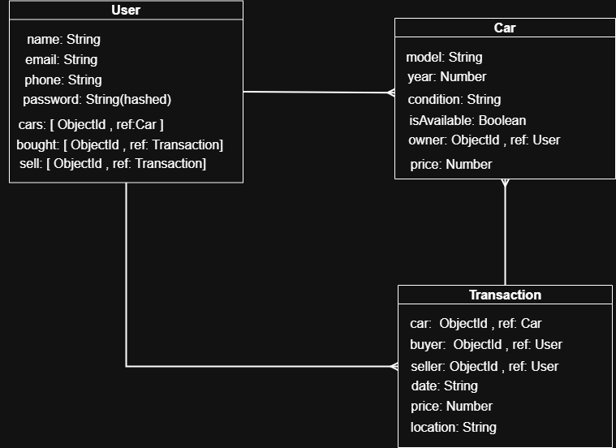
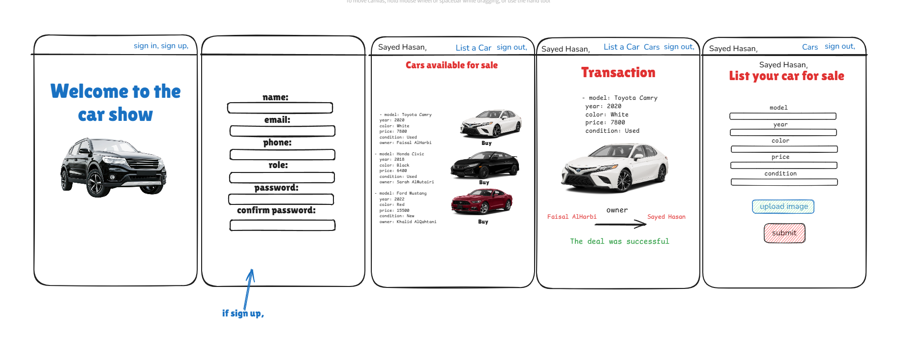

# Car App

# **User Stories:**
[User-Stories](./planning-materials/User-Stories.md) 

## ERD

## WireFrame

## Description

This is a car management application that allows users to manage cars and transactions.

## How to Run

1.  Clone the repository.
2.  Install dependencies: `npm install`
3.  Start the server: `npm start`
4.  Open the application in your browser at `http://localhost:4000`

## File Structure

# **controllers**: Contains the route handlers for the application.

`authController.js`: Handles authentication routes.
`registerUser`: Registers a new user.
`signInUser`: Signs in an existing user.
`signOutUser`: Signs out the current user.
`updatePassword`: Updates the user's password.
`carController.js`: Handles car routes.
`addCar`: Adds a new car.
`getAllCars`: Retrieves all cars.
`getCarById`: Retrieves a car by its ID.
`updateCarById`: Updates a car by its ID.
`deleteCarById`: Deletes a car by its ID.
`tranController.js`: Handles transaction routes.
`getAllTran`: Retrieves all transactions.
`buyCar`: Handles the purchase of a car.
`userController.js`: Handles user routes.
`getUserById`: Retrieves a user by their ID.
`getUserPro`: Retrieves a user's profile.

# **db**: Contains the database connection. 

# **models**: Contains the database models.

`Car.js`: Car model.
`model`: Car model (String, required).
`year`: Year of manufacture (Number, required).
`condition`: Condition of the car (String, required).
`isAvailable`: Availability status (Boolean, required).
`owner`: Owner of the car (ObjectId, ref: "User").
`price`: Price of the car (Number, required).
`Transaction.js`: Transaction model.
`car`: Reference to the Car model (ObjectId, required).
`buyer`: Reference to the User model (ObjectId, required).
`seller`: Reference to the User model (ObjectId, required).
`date`: Date of the transaction (Date, default: Date.now).
`price`: Price of the car (Number, required).
`location`: Location of the transaction (String, required).
`User.js`: User model.
`name`: User's name (String, required).
`email`: User's email (String, required).
`password`: User's password (String, required).
`phone`: User's phone number (String).
`cars`: Array of references to Car models (ObjectId).
`bought`: Array of references to Transaction models (ObjectId).
`sell`: Array of references to Transaction models (ObjectId).

# **routes**: Contains the routes for the application.

`authRouter.js`: Authentication routes.
`/sign-up` (POST): Registers a new user.
`/sign-up` (GET): Renders the sign-up form.
`/sign-in` (POST): Signs in an existing user.
`/sign-in` (GET): Renders the sign-in form.
`/sign-out` (GET): Signs out the current user.
`/:id` (PUT): Updates the user's password.
`/:id/update-password` (GET): Renders the update password form.
`carRouter.js`: Car routes.
`/new` (GET): Renders the form to add a new car.
`/edit/:id` (GET): Renders the form to edit a car.
`/new` (POST): Adds a new car.
`/all` (GET): Retrieves all cars.
`/:id` (GET): Retrieves a car by its ID.
`/update` (POST): Updates a car.
`/delete` (POST): Deletes a car.
`tranRouter.js`: Transaction routes.
`/buy/:id` (GET): Renders the form to buy a car.
`/buy` (POST): Handles the purchase of a car.
`/all` (GET): Retrieves all transactions.
`userRouter.js`: User routes.
`/:id` (GET): Retrieves a user by their ID.
`/:id` (GET): Retrieves a user's profile.

# **styles**: Contains the CSS styles for the application.

`style.css`: CSS styles.

# **views**: Contains the EJS templates for the application.

`auth`: Authentication templates.
`cars`: Car templates.
`transactions`: Transaction templates.
`users`: User templates.
`index.ejs`: Index template.
`.env`: Contains the environment variables.
`.gitignore`: Specifies intentionally untracked files that Git should ignore.
`package-lock.json`: Records the exact versions of dependencies used in the project.
`package.json`: Contains metadata about the project, such as the name, version, and dependencies.
`README.md`: This file, providing information about the project.
`server.js`: The main entry point for the application.
