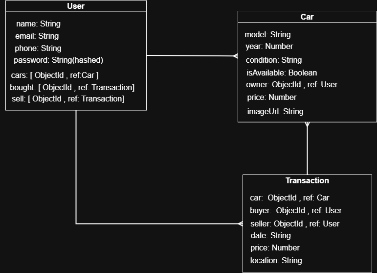

# Car App

# **User Stories:**
[User-Stories](./planning-materials/User-Stories.md) 

## ERD

## WireFrame

## Description

This is a car application that allows users to buy & sell cars and transactions.

## How to Run

1.  Clone the repository.
2.  Install dependencies: `npm install`
3.  Start the server: `npm start`
4.  Open the application in your browser at `http://localhost:4000`

## File Structure

# **controllers**: Contains the route handlers for the application.

-`authController.js`: Handles authentication routes. 
-`registerUser`: Registers a new user. 
-`signInUser`: Signs in an existing user. 
-`signOutUser`: Signs out the current user. 
-`updatePassword`: Updates the user's password. 
-`carController.js`: Handles car routes. 
-`addCar`: Adds a new car. 
-`getAllCars`: Retrieves all cars. 
-`getCarById`: Retrieves a car by its ID. 
-`updateCarById`: Updates a car by its ID. 
-`deleteCarById`: Deletes a car by its ID. 
-`tranController.js`: Handles transaction routes. 
-`getAllTran`: Retrieves all transactions. 
-`buyCar`: Handles the purchase of a car. 
-`userController.js`: Handles user routes. 
-`getUserById`: Retrieves a user by their ID. 
-`getUserPro`: Retrieves a user's profile. 

# **db**: Contains the database connection. 

# **models**: Contains the database models.

-`Car.js`: Car model. 
-`model`: Car model (String, required).  
-`year`: Year of manufacture (Number, required).  
-`condition`: Condition of the car (String, required). 
-`isAvailable`: Availability status (Boolean, required). 
-`owner`: Owner of the car (ObjectId, ref: "User"). 
-`price`: Price of the car (Number, required). 
-`Transaction.js`: Transaction model. 
-`car`: Reference to the Car model (ObjectId, required). 
-`buyer`: Reference to the User model (ObjectId, required). 
-`seller`: Reference to the User model (ObjectId, required). 
-`date`: Date of the transaction (Date, default: Date.now). 
-`price`: Price of the car (Number, required). 
-`location`: Location of the transaction (String, required). 
-`User.js`: User model. 
-`name`: User's name (String, required). 
-`email`: User's email (String, required). 
-`password`: User's password (String, required). 
-`phone`: User's phone number (String). 
-`cars`: Array of references to Car models (ObjectId). 
-`bought`: Array of references to Transaction models (ObjectId). 
-`sell`: Array of references to Transaction models (ObjectId). 

# **routes**: Contains the routes for the application.

-`authRouter.js`: Authentication routes. 
-`/sign-up` (POST): Registers a new user. 
-`/sign-up` (GET): Renders the sign-up form. 
-`/sign-in` (POST): Signs in an existing user. 
-`/sign-in` (GET): Renders the sign-in form. 
-`/sign-out` (GET): Signs out the current user. 
-`/:id` (PUT): Updates the user's password. 
-`/:id/update-password` (GET): Renders the update password form. 
-`carRouter.js`: Car routes. 
-`/new` (GET): Renders the form to add a new car. 
-`/edit/:id` (GET): Renders the form to edit a car. 
-`/new` (POST): Adds a new car. 
-`/all` (GET): Retrieves all cars. 
-`/:id` (GET): Retrieves a car by its ID. 
-`/update` (POST): Updates a car. 
-`/delete` (POST): Deletes a car. 
-`tranRouter.js`: Transaction routes. 
-`/buy/:id` (GET): Renders the form to buy a car. 
-`/buy` (POST): Handles the purchase of a car. 
-`/all` (GET): Retrieves all transactions. 
-`userRouter.js`: User routes. 
-`/:id` (GET): Retrieves a user by their ID. 
-`/:id` (GET): Retrieves a user's profile. 

# **styles**: Contains the CSS styles for the application.

-`style.css`: CSS styles. 

# **views**: Contains the EJS templates for the application.

-`auth`: Authentication templates. 
-`cars`: Car templates. 
-`transactions`: Transaction templates. 
-`users`: User templates. 
-`index.ejs`: Index template. 
-`.env`: Contains the environment variables. 
-`.gitignore`: Specifies intentionally untracked files that Git should ignore. 
-`package-lock.json`: Records the exact versions of dependencies used in the project. 
-`package.json`: Contains metadata about the project, such as the name, version, and dependencies. 
-`README.md`: This file, providing information about the project. 
-`server.js`: The main entry point for the application. 
